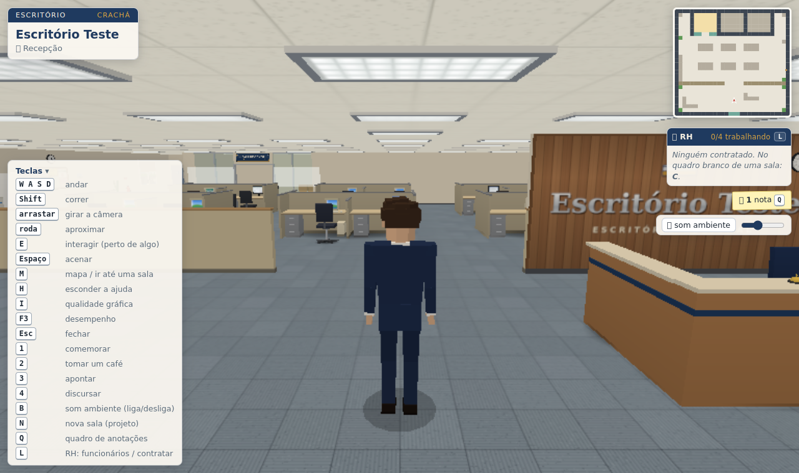
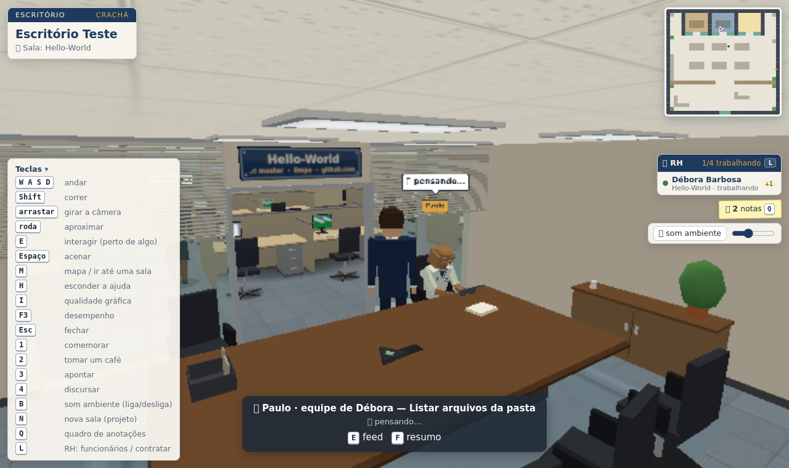
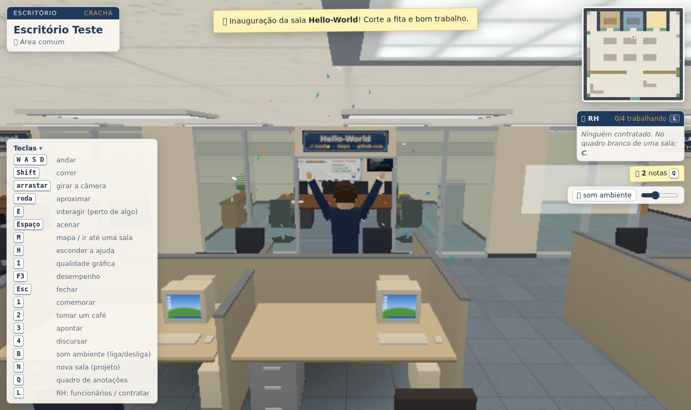
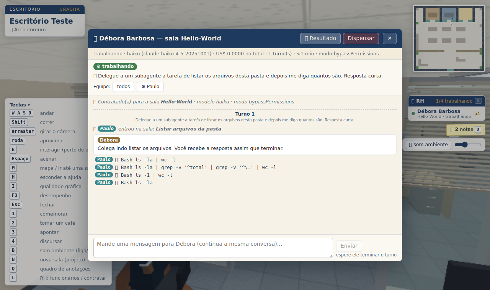

# Escritório Virtual

Um escritório 3D no navegador, estilo *The Office*, onde **a empresa é uma pasta**, **cada sala de reunião é um
projeto** e **os funcionários são instâncias do [Claude Code](https://docs.claude.com/en/docs/claude-code/overview)**
trabalhando nos seus projetos. Você anda pelo escritório com um bonequinho de terno e gravata, e acompanha tudo de perto.



- 🏢 **A empresa é uma pasta.** No primeiro acesso ele pergunta o nome e cria `~/escritorios/<Nome>/`.
- 🚪 **Cada sala de reunião é um projeto** (uma subpasta). Crie do zero ou clone de um link git.
- 📌 **Quadro de anotações:** cada post-it é um arquivo `.md` que você escreve e edita ali mesmo.
- 🧑‍💼 **Funcionários = Claude Code.** Você contrata um numa sala e dá uma tarefa. Ele trabalha **sempre em equipe**:
  cada subagente que ele chama vira outro bonequinho, que entra pela porta, trabalha e sai ao terminar.
  Chegue perto de qualquer um para ver o que está fazendo.



> ⚠️ **Os funcionários trabalham sem pedir permissão** (modo "tudo liberado"). Leia [Permissões e riscos](#permissões-e-riscos)
> antes de contratar o primeiro.

## Sumário

- [Requisitos](#requisitos)
- [Instalação e primeira execução](#instalação-e-primeira-execução)
- [Primeiros passos (tour de 5 minutos)](#primeiros-passos-tour-de-5-minutos)
- [Controles](#controles)
- [O que tem no escritório](#o-que-tem-no-escritório)
- [Funcionários (Claude Code)](#funcionários-claude-code)
- [Permissões e riscos](#permissões-e-riscos)
- [Configuração (opções e variáveis de ambiente)](#configuração-opções-e-variáveis-de-ambiente)
- [Onde ficam os dados](#onde-ficam-os-dados)
- [Problemas comuns](#problemas-comuns)
- [Para desenvolvedores](#para-desenvolvedores)

## Requisitos

| O quê | Versão / detalhe | Para quê |
|---|---|---|
| **Linux ou WSL2** | testado no WSL2 (Ubuntu 24.04) | o servidor usa `/proc` e grupos de processo do Linux. No Windows, rode dentro do WSL. macOS não foi testado |
| **Python** | 3.12 (só a biblioteca padrão, **sem `pip install`**) | o servidor |
| **git** | qualquer versão recente | clonar projetos e mostrar branch/alterações nas salas |
| **Navegador com WebGL** | Chrome, Edge ou Firefox atuais | o escritório 3D. Na primeira abertura precisa de internet (o Three.js vem de CDN) |
| **Claude Code** | CLI `claude` instalada e **logada** | os funcionários. Sem ela, o resto do escritório funciona normalmente |

Para instalar e logar o Claude Code (veja a [documentação oficial](https://docs.claude.com/en/docs/claude-code/overview)):

```bash
curl -fsSL https://claude.ai/install.sh | bash   # ou: npm install -g @anthropic-ai/claude-code
claude                                           # na primeira vez, faça o login e depois saia com /exit
```

Os funcionários usam a sua conta do Claude (assinatura ou API). Cada tarefa tem teto de custo configurável (padrão
**US$ 1,00 por tarefa**, veja [Configuração](#configuração-opções-e-variáveis-de-ambiente)).

## Instalação e primeira execução

```bash
git clone https://github.com/Felipe-Meneguzzi/escritorio-virtual.git
cd escritorio-virtual
python3 server.py
```

1. O servidor sobe em **http://localhost:8766/** e tenta abrir o navegador sozinho (no WSL abre o navegador do
   Windows; no Linux usa `xdg-open`). Se não abrir, abra o endereço na mão.
2. Na tela de boas-vindas, digite o **nome do escritório** (ex.: `Papelaria Scranton`). Isso cria
   `~/escritorios/Papelaria Scranton/`, e a próxima abertura já cai direto nele.
3. Pronto: você está na recepção. **`Ctrl+C`** no terminal encerra o expediente.

Opções mais usadas:

```bash
python3 server.py --no-open                 # não abre o navegador
python3 server.py --port 8780               # outra porta
python3 server.py --root ~/minhas-empresas  # outra pasta raiz de escritórios
ESC_MODO=auto python3 server.py             # funcionários com mais cautela (veja Permissões e riscos)
```

## Primeiros passos (tour de 5 minutos)

1. **Ande:** `W A S D` (ou setas), `Shift` para correr, arraste o mouse para girar a câmera e use a roda para aproximar.
   Aperte `M` para ver a planta e clicar num lugar para ir até lá.
2. **Escreva uma nota:** vá até o **quadro de anotações** (ou aperte `Q`), aperte `C`, escreva e salve com `Ctrl+S`.
   Ela vira um post-it no quadro e um arquivo em `~/escritorios/<Nome>/quadro/`.
3. **Crie uma sala (projeto):** aperte `N` e escolha:
   - **Do zero:** nome + descrição (cria a pasta, um README e, se quiser, um `git init`);
   - **Clonar do git:** cole um link (`https://…`, `ssh://…` ou `git@host:org/repo.git`). Enquanto clona, a vaga vira
     uma obra com barra de progresso; no fim tem inauguração com confete.

   
4. **Entre na sala:** o **gaveteiro** (`E`) mostra os arquivos do projeto, e a **mesa** (`F`) mostra o resumo (git e README).
5. **Contrate um funcionário:** perto do **quadro branco da sala**, aperte `C`, escreva a tarefa (ex.: *"revise o README
   e sugira melhorias"*), escolha o modelo, marque "Entendi" e contrate.
6. **Acompanhe:** chegue perto dele e veja o balão com o que está fazendo. `E` abre o feed completo, `R` manda
   mensagem, `F` mostra o resultado e `X` dispensa.

   

## Controles

| Tecla | Ação |
|---|---|
| `W A S D` / setas | andar (relativo à câmera) |
| `Shift` | correr |
| arrastar o mouse / roda | girar a câmera / aproximar |
| **`E`** | interagir com o que está perto. O aviso embaixo da tela mostra as teclas que valem ali |
| `Espaço` | acenar |
| `1` `2` `3` `4` | comemorar, tomar café, apontar, discursar |
| `M` ou `Tab` | planta do prédio (clique numa sala, recepção, quadro ou copa para ir até lá) |
| `N` | nova sala (projeto), de qualquer lugar |
| `Q` | quadro de anotações, de qualquer lugar |
| `L` | RH: lista de funcionários, contratar, feed e resultado |
| `B` | som ambiente liga/desliga (o volume fica no canto direito) |
| `H` | mostra ou esconde a ajuda |
| `I` | qualidade gráfica: auto → alta → média → baixa (vale depois de recarregar) |
| `F3` | desempenho (FPS, draw calls, triângulos) |
| `Esc` | fecha o painel |

**Teclas contextuais** (valem perto de algo): **`E`** abrir/ver, **`R`** mandar mensagem, **`F`** resultado/resumo,
**`X`** dispensar (sempre pede confirmação), **`C`** criar (contratar, nova nota) e **`V`** extra.

No editor de notas: `Ctrl+S` salva, `Ctrl+B` / `Ctrl+I` aplicam negrito/itálico, `Enter` continua listas e `Esc`
fecha (o rascunho fica guardado).

## O que tem no escritório

**Recepção:** balcão com campainha (`E`), sofá e o letreiro com o nome da empresa. A porta de entrada (`E`) troca de
escritório, se você tiver mais de um.

**Quadro de anotações** (parede da área comum, ou `Q`):
- Cada post-it é um arquivo em `<escritório>/quadro/`. Perto do quadro, `E` abre a nota mirada e `C` cria uma nova.
- Editor com pré-visualização markdown. Clicar num checkbox da pré-visualização marca a tarefa no arquivo.
- Se o arquivo mudar por fora (outro editor, um funcionário), ele avisa e você escolhe qual versão fica.
- Apagar pede confirmação e manda para a lixeira (`.escritorio/lixeira/`), com "Desfazer".

**Salas de reunião = projetos:**
- A vaga **"+ SALA DISPONÍVEL"** (`E`, ou `N` de qualquer lugar) cria uma sala nova, do zero ou clonando do git.
  O prédio cresce sozinho conforme o número de salas.
- **Gaveteiro** (`E`): navegador dos arquivos do projeto, só leitura. Código aparece com realce e markdown formatado;
  a pasta `.git` nunca é mostrada.
- **Mesa** (`E` papéis, `F` resumo): números do projeto, git e README.
- **Quadro branco:** `C` contrata um funcionário, `E` mostra a equipe da sala.
- A placa sobre a porta mostra a branch e as alterações do git; a TV da sala mostra o status.
- Uma pasta criada por fora dentro do escritório vira sala sozinha.

**Copa e área aberta:** cafeteira, bebedouro, geladeira e donuts (`E` em cada um). A copiadora tira cópia com `E` e
atola com `V`. O mural (`E`) mostra avisos e o calendário.

## Funcionários (Claude Code)

1. Vá até o quadro branco de uma sala e aperte **`C`** (ou use **`L`** de qualquer lugar).
2. Escreva a tarefa, escolha o modelo (**haiku** rápido e barato, **sonnet** equilibrado, **opus** caprichado e mais
   caro), marque "Entendi" e contrate.
3. O funcionário chega correndo da recepção até a sala. O que ele faz aparece no boneco:
   - lendo arquivos → vai ao gaveteiro com papéis;
   - editando → senta e digita no laptop;
   - rodando comandos → laptop com a tela piscando;
   - planejando → vai ao quadro branco;
   - delegando → aponta para a porta, e chega um colega (**subagente**) de crachá e mangas dobradas.
4. **Chegue perto** de qualquer um para ver o balão com a atividade atual. Perto do funcionário principal:
   - **`E`** feed completo (ele e a equipe, com filtro por colega);
   - **`R`** mensagem que continua a mesma conversa;
   - **`F`** resultado, com o custo do turno e o total;
   - **`X`** dispensar (interrompe se estiver trabalhando; se estiver parado, ele vai embora).
5. Quando termina, ele comemora e senta com um cafezinho (selo ✓). Os subagentes saem pela porta.

Detalhes úteis:
- Os funcionários **continuam trabalhando se você fechar a aba**. Se o servidor reiniciar no meio de um trabalho,
  ele reata o processo que ainda estiver vivo.
- Ao fechar o servidor com `Ctrl+C`, ele avisa quantos continuam trabalhando. Com `ESC_ENCERRAR_AO_SAIR=1`, dispensa
  todos ao fechar.
- Sessões interativas do Claude Code que você tiver abertas dentro de uma sala aparecem como **visitantes** (👀), só
  para ver. O escritório nunca retoma nem mexe nessas conversas.

## Permissões e riscos

Por padrão os funcionários rodam com `--dangerously-skip-permissions` (**"tudo liberado na sala"**): eles executam
comandos e editam arquivos **sem pedir sua confirmação**. A tela de contratar avisa isso e só libera o botão depois
que você marca "Entendi".

**Isso NÃO é uma caixa de areia.** O funcionário começa na pasta da sala e é instruído a não sair dela, mas roda com o
seu usuário: se quiser (ou for enganado), consegue ler e escrever qualquer arquivo que você consegue e rodar qualquer
comando.

**O que o app faz para reduzir o risco:**
- O prompt vai por stdin, nunca pela linha de comando.
- `--setting-sources user`, `--strict-mcp-config` e `--disable-slash-commands`: o funcionário **ignora** hooks,
  `.mcp.json`, `.claude/settings`, `.claude/agents` e `.claude/skills` de um repositório clonado. Um repo malicioso
  não executa nada sozinho só por ser aberto. As suas skills pessoais também ficam desligadas nos funcionários.
- Sem internet por padrão (WebFetch e WebSearch desligados).
- Limites de custo, tempo e quantidade (tabela abaixo): no máximo 4 funcionários ao mesmo tempo.
- O servidor só escuta em `127.0.0.1`, e toda rota confere Host, Origin e um cabeçalho anti-CSRF: outro site aberto
  no navegador não consegue mandar nada.
- O `git status` das placas não roda se a configuração do repo tiver algo perigoso (hooks, fsmonitor, include,
  sshCommand); filtros clean/smudge do repo são neutralizados.
- Clone: só `https`, `ssh` e `git@`; host que resolve para rede local/interna é recusado; no máximo 2 clones
  simultâneos. Se a URL tiver `usuario:token@`, o token **não** fica gravado no `.git/config` da sala.
- Processos que o funcionário deixa rodando ao terminar (`npm run dev &`, watchers) são encerrados.

**O que continua valendo mesmo assim:**
- O **`CLAUDE.md` / `AGENTS.md` do projeto é lido como instrução.** Num repo de terceiros ele pode mandar o funcionário
  fazer besteira (*prompt injection*). Salas clonadas com esses arquivos ou com uma pasta `.claude/` mostram um alerta
  extra ao contratar.
- Plugins e agentes do seu `~/.claude` carregam em todo funcionário.
- Um funcionário no modo liberado consegue chamar a própria API do escritório (via `curl` no localhost).

**Recomendações:**
- Só contrate funcionários em projetos em que você confia. Cuidado com repositórios de terceiros.
- Tenha o projeto no git (ou em backup) antes de pedir mudanças grandes.
- Quer mais controle? Use `ESC_MODO=auto` (um classificador do Claude aprova ou barra cada ação) ou
  `ESC_MODO=acceptEdits` (edita arquivos, mas comandos que precisariam de permissão são recusados). O que for
  recusado deixa o funcionário com o selo ⛔ e o feed mostra o motivo.

## Configuração (opções e variáveis de ambiente)

Opções de linha de comando:

| Opção | Padrão | O que faz |
|---|---|---|
| `--root <pasta>` (ou `ESC_ROOT`) | `~/escritorios` | raiz dos escritórios |
| `--port <n>` (ou `ESC_PORT`) | `8766` | porta do servidor |
| `--no-open` | — | não abre o navegador sozinho |
| `--verbose` | — | loga cada requisição |

Só um servidor por raiz: se já houver outro rodando na mesma pasta, o segundo avisa e sai.

Variáveis de ambiente:

| Variável | Padrão | O que é |
|---|---|---|
| `ESC_MODO` | `bypassPermissions` | modo de permissão: `bypassPermissions`, `auto` ou `acceptEdits` |
| `ESC_MAX_FUNC` | `4` | funcionários trabalhando ao mesmo tempo |
| `ESC_MAX_POR_SALA` | `3` | funcionários por sala |
| `ESC_BUDGET` | `1.00` | teto em US$ por tarefa/turno (`--max-budget-usd`) |
| `ESC_BUDGET_SESSAO` | `5.00` | acima desse custo acumulado, o funcionário não aceita mais mensagens |
| `ESC_WALL` | `1800` | segundos máximos de um turno |
| `ESC_TURNS` | `80` | `--max-turns` por turno |
| `ESC_SUBS_PAR` | `3` | subagentes simultâneos por funcionário |
| `ESC_WEB` | desligado | `1` libera WebFetch/WebSearch |
| `ESC_FILA` | desligado | `1` enfileira uma mensagem enquanto ele trabalha |
| `ESC_CLONE_TIMEOUT` / `ESC_CLONE_MAX_MB` | `600` / `2048` | segundos e MB máximos de um clone |
| `ESC_CLONE_HOSTS_INTERNOS` | vazio | hosts (separados por vírgula) liberados mesmo resolvendo para rede interna, ex. o GitLab da empresa |
| `ESC_MATAR_SOBRAS` | `1` | `0` = não encerra processos deixados pelo funcionário |
| `ESC_ENCERRAR_AO_SAIR` | desligado | `1` = `Ctrl+C` dispensa quem estiver trabalhando |
| `ESC_DRY_RUN` | desligado | modo de teste: funcionários **simulados** (não gastam nada) e navegador não abre |

Exemplo:

```bash
ESC_MODO=auto ESC_BUDGET=0.50 ESC_MAX_FUNC=2 python3 server.py
```

## Onde ficam os dados

```
~/escritorios/
└── <Nome do escritório>/
    ├── quadro/                  notas do quadro (.md) — pode editar por fora também
    ├── <Sala 1>/                cada sala é uma pasta de projeto normal (o seu código)
    ├── <Sala 2>/
    └── .escritorio/             metadados do app (apague para recomeçar do zero)
        ├── office.json          nome, cores e ordem das salas
        ├── quadro.json          posição dos post-its
        ├── lixeira/             notas apagadas
        └── rh/<id>/             cada funcionário: meta.json, eventos.ndjson (feed), out.ndjson (stream bruto), err.log
```

- Fora o README e o `git init` de uma sala criada do zero, o app não grava nada dentro das salas. Quem mexe lá são
  os funcionários (e você).
- O app **nunca apaga** pastas de sala. Para renomear ou remover um projeto, use o sistema de arquivos.
- As conversas dos funcionários também ficam no histórico normal do Claude Code (`~/.claude/projects/…`).

## Problemas comuns

| Sintoma | O que fazer |
|---|---|
| Tela cinza / "Não consegui falar com o servidor" | o servidor não está rodando ou está em outra porta |
| O navegador não abriu sozinho | abra http://localhost:8766/ na mão (ou use `--no-open`) |
| Lento / travando | aperte `I` até "baixa" e recarregue (F5). Confira se o navegador está com **aceleração de hardware** ligada. `F3` mostra os números |
| Funcionário com ⚠️ (erro) | abra o feed (`E`) ou o resultado (`F`). Confira se o `claude` está logado rodando `claude` no terminal |
| Funcionário com ⛔ (bloqueado) | o modo atual (`auto`/`acceptEdits`) recusou alguma ação; o feed mostra qual |
| Clone falhou (obra "embargada") | repo privado sem credencial, URL errada ou sem rede. Chegue perto para "Tentar de novo" |
| "o host … aponta para um endereço local/interno" | para um servidor git seu de confiança: `ESC_CLONE_HOSTS_INTERNOS=gitlab.suaempresa.com` |
| "já existe um servidor nesta raiz" | outro `server.py` está usando a mesma pasta; feche-o ou use `--root` |

## Para desenvolvedores

- Arquitetura, API interna das features, eventos, rotas e contratos: [`ARCH.md`](ARCH.md).
- Estrutura: `server.py` + `esc_core.py` (servidor HTTP stdlib, segurança, estáticos), `features/*.py` (rotas
  carregadas automaticamente: `rh.py` funcionários, `salas.py` projetos/clone, `quadro.py` notas), `js/core/*` (motor:
  cena, jogador, colisão, HUD), `js/office/*` (planta do prédio), `js/features/*` (personagens, funcionários, salas,
  quadro, ambiente). Three.js r160 via CDN, sem build.
- Testes do layout: `node tests/layout.test.mjs` (ou `npm test`).
- Para testar sem gastar tokens: `ESC_DRY_RUN=1 python3 server.py --root /tmp/escritorios-teste` (funcionários simulados).
